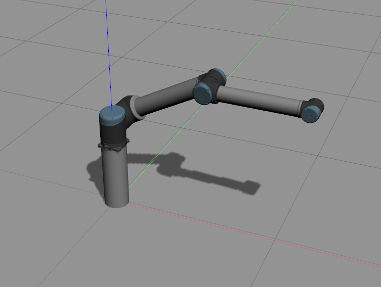
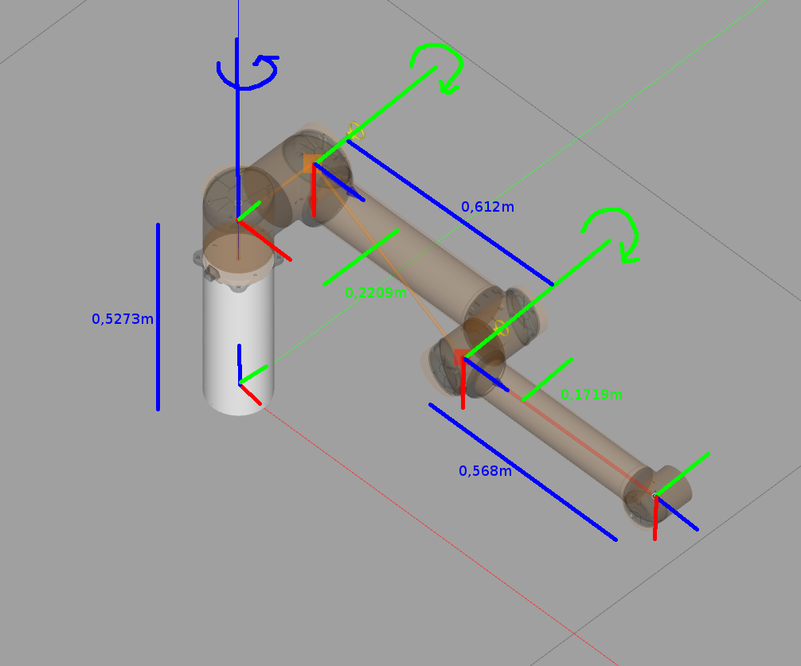
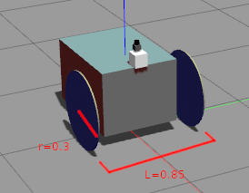
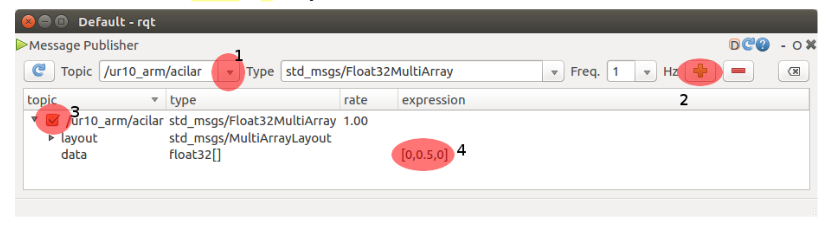
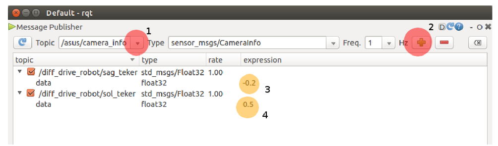

# Gazebo ROS Plugin

## 3 DOF Robotic Arm

3 DOF (degree of freedom) robot kolu 3 farklı yer/eksende hareket/dönüş kabiliyetine sahiptir. 




Robot kolu tüm eklemlerinde 0 radyan uygulanmış iken dönüş eksenleri, yerel koordinat çerçeveleri ve yerel çerçeveler arası mesafeler aşağıdaki şekil ile verilmektedir. Robot kolununun yerel eksen takımında y-eksenine göre döner eklemleri yeşil, z-eksenine göre döner eklemleri mavi renk ile gösterilmektedir. Tüm eklemler $(-2\pi, 2\pi)$ radyan aralığında dönüşe imkan vermektedir. 



## Differetial Drive Model

Gazebo ortamında oluşturulmuş bir diferansiyel sürüşlü robot için tekerlek yarıçapı (r=0.3m) ve sürüş
tekerleklerinin arasındaki mesafe (L=0.85) değerlerine sahiptir.



## Install
```
cd ~/robotlar_ws/src
git clone https://gitlab.com/blm6191_2023_1/blm6191/gazebo_plugins_rtg.git
cd ~/robotlar_ws
rosdep install --from-paths src --ignore-src --rosdistro noetic -y
catkin_make
source ~/.bashrc
```

## Run 

Run the following for only once:
~~~
cp -r ~/robotlar_ws/src/gazebo_plugins_rtg/models/ur10_short ~/.gazebo/models
cp -r ~/robotlar_ws/src/gazebo_plugins_rtg/models/small_cabinet ~/.gazebo/models
cp -r ~/robotlar_ws/src/gazebo_plugins_rtg/models/DiffDrive ~/.gazebo/models
~~~

Run the simulation with only 3 dof robotic arm (ur10) model using position pid controller:
~~~
roslaunch gazebo_plugins_rtg ur10_short.launch
~~~

Run the simulation with ur10 and the cabinet model:
~~~
roslaunch gazebo_plugins_rtg ur10_short_box.launch
~~~

Run the simulation with differetial drive model using angular velocity pid controller:
```
roslaunch gazebo_plugins_rtg hello.launch
```

Run message publisher for 3 dof robotic arm model angular positions or differetial drive model angular velocities with rqt_gui
```
rosrun rqt_gui rqt_gui
```
Select Plugins > Topics > Message Publisher from rqt to display the message publisher plugin.

Follow these steps to publish angular position messages for the robotic arm.


Follow these steps to publish angular velocity messages for the differetial drive model.


Run message publisher for differetial drive model angular velocities
Edit, compile and run cmd.cpp
```
rosrun gazebo_plugins_rtg cmd
```